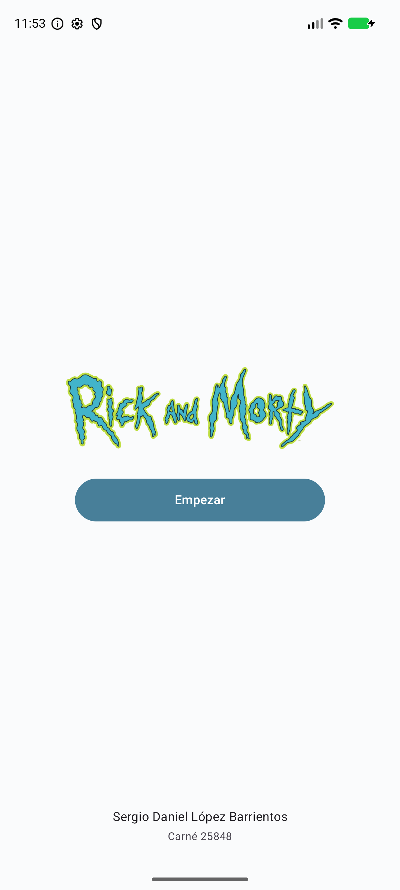
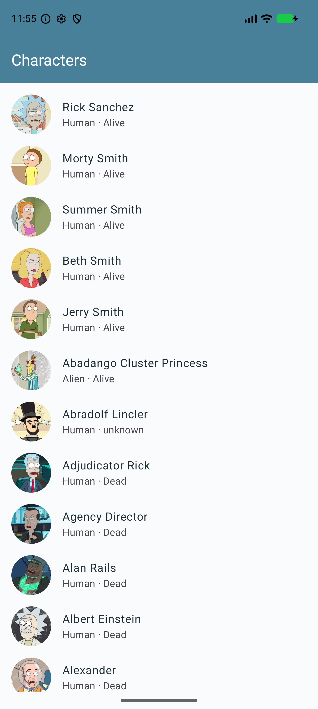
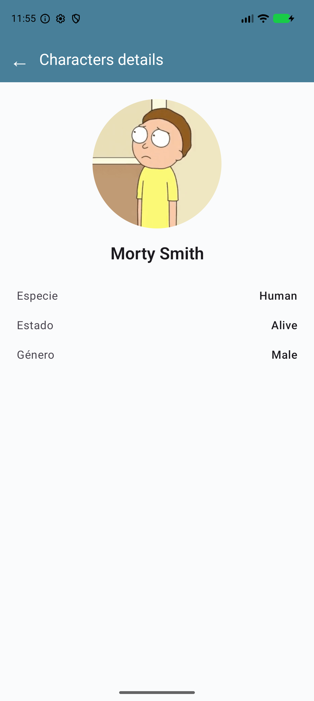

# Verificación de la entrega

Fecha: 20 de septiembre de 2026.

## Resultados

- APK de depuración compilado correctamente con Gradle 9.5.0, Android Gradle Plugin 9.3.2 y SDK 37.
- **3 de 3 pruebas unitarias aprobadas**: datos originales, consulta de Morty por ID y serialización del destino con únicamente el ID.
- **4 de 4 pruebas de interfaz aprobadas** en Pixel 10 Pro XL, Android 17: login con los datos del estudiante, eliminación del login del historial y salida, detalle y regreso por ambos métodos, y manejo de ID inexistente.
- **Android Lint: 0 errores, 9 advertencias**. Las advertencias se refieren a versiones más recientes de dependencias, nivel de Android objetivo y configuración de copias de seguridad; no impiden compilar ni ejecutar el laboratorio.
- Revisión visual de las tres pantallas: logo, identificación, lista con retratos descargados por Coil y detalle de Morty con sus datos.
- Comprobación adicional en el APK instalado: Atrás desde el detalle regresa a la lista; Atrás desde la lista finaliza la tarea; una nueva apertura muestra Login con el carné 25848.
- `Character.kt` y `CharacterDb.kt` conservan exactamente los archivos proporcionados, con la única adición del paquete Kotlin.

## Capturas reales del emulador

| Login | Characters | Characters details |
| --- | --- | --- |
|  |  |  |

## Pendiente de entrega externa

El proyecto está preparado localmente en la rama `laboratorio7`. No se ha publicado en GitHub ni enviado a la plataforma del curso. El estudiante debe adjuntar el APK y proporcionar el enlace al repositorio en su entrega.

Si se usa el ZIP de código fuente, este no contiene el historial de Git. Para iniciar un repositorio desde la carpeta extraída:

```sh
git init -b laboratorio7
git add .
git commit -m "Completar laboratorio 7: navegación y personajes"
```

Después se puede asociar el repositorio de GitHub elegido y subir la rama. La carpeta original del proyecto ya incluye el repositorio Git local.
